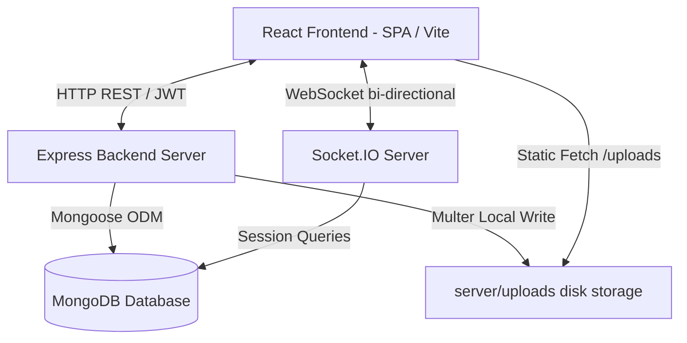
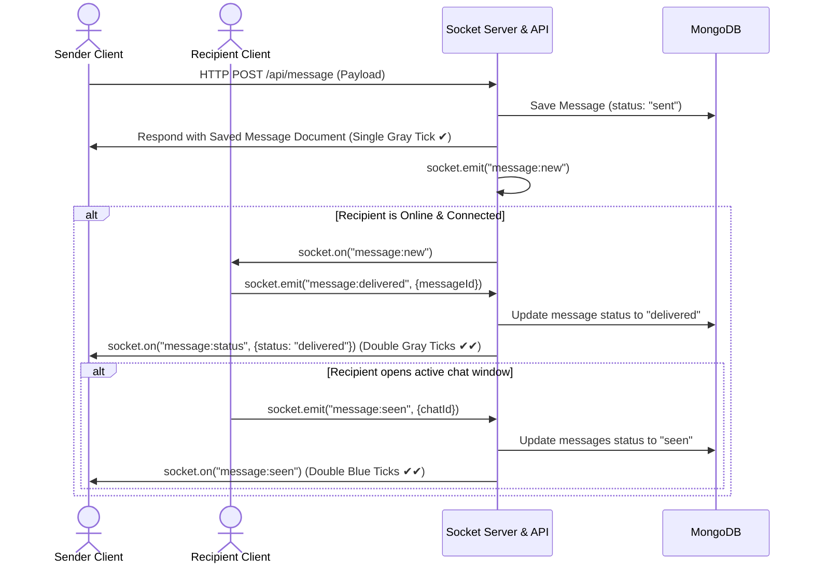

# Realtime Collaborative Chat Platform (Telegram Web Replica)

A complete, production-ready, full-stack collaborative real-time messaging application designed to replicate the Telegram Web client. Built using React, Node.js, Express, Socket.IO, and MongoDB, this platform features responsive split-views, a 3rd column details panel, rich-theme customization, real-time presence indicators, typing feedback, file uploads, seen/delivered tick receipts, and user privacy constraints.

---

## 🏛️ System Architecture

The platform follows a three-tier architectural pattern optimized for real-time, bi-directional event communication and static asset delivery:



### Architectural Highlights
1. **Real-time Event Broker (Socket.IO):** Handles live persistent TCP connections, manages chat rooms (identified as `chat:<chatId>`), distributes typing statuses, broadcasts online/offline changes, and synchronization events.
2. **Static Asset Streaming:** Standard REST routes manage high-throughput file uploads (e.g. avatars, attachments). Uploaded files are written directly to local disk volumes (`server/uploads`) and served statically, keeping MongoDB memory footprint minimal.
3. **Data Tier (Mongoose ODM + MongoDB):** Relational schema structures (using ObjectIds and DB refs) store messages, users, and chats.

---

## 📂 Folder Structure

```text
chat-platform/
├── client/
│   ├── src/
│   │   ├── context/      # AuthContext, ChatContext (State Providers)
│   │   ├── components/   # ChatWindow, SettingsPanel, GroupModal, etc.
│   │   ├── pages/        # LoginPage, RegisterPage, DashboardPage (Main Shell)
│   │   ├── hooks/        # custom hooks (useSocket)
│   │   ├── services/     # api wrapper services
│   │   └── index.css     # Design system, themes & animations
├── server/
│   ├── config/           # db.js (MongoDB Connection configuration)
│   ├── controllers/      # auth, user, chat, message controller handlers
│   ├── models/           # Mongoose schemas (User, Chat, Message)
│   ├── routes/           # REST endpoints mapping
│   ├── middleware/       # auth.js (JWT validation middleware)
│   ├── sockets/          # socket event registration and handlers
│   ├── uploads/          # local directory for binary files/avatars
│   └── index.js          # App entry point
└── docker-compose.yml    # Container orchestration manifest
```

---

## 🗄️ MongoDB Schema Reference

### 1. User Schema (`User` Collection)
Persists account credentials, current status, devices session list, and appearance settings:
* **`username`**: `String` (Unique, Trimmed, Required) — Primary handle.
* **`email`**: `String` (Unique, Lowercase, Trimmed, Required) — Secure identifier.
* **`password`**: `String` (Required) — Hashed via bcryptjs.
* **`avatar`**: `String` (Default: `""`) — URL path to profile picture.
* **`isOnline`**: `Boolean` (Default: `false`) — Live socket indicator.
* **`lastSeen`**: `Date` (Default: `Date.now`) — Timestamp of last socket disconnection.
* **`preferences`**:
  * `theme`: `String` (`"system"`, `"light"`, `"dark"`; Default: `"system"`)
  * `accent`: `String` (`"teal"`, `"blue"`, `"sunset"`, `"rose"`; Default: `"teal"`)
  * `showEmail`: `Boolean` (Default: `true`) — Privacy toggle mapping peer visibility.
* **`loginEntries`**: `Array` — Devices log monitoring:
  * `sessionId` (String, Required), `userAgent` (String), `ipAddress` (String), `createdAt` (Date), `lastActiveAt` (Date).

### 2. Chat Schema (`Chat` Collection)
Represents a messaging channel (direct or group):
* **`participants`**: `[ObjectId]` (Ref: `"User"`) — Array of member IDs.
* **`isGroup`**: `Boolean` (Default: `false`) — Identifies room type.
* **`directKey`**: `String` (Sparse, Unique) — Compound string (`id1_id2`) preventing duplicate direct chats.
* **`groupName`**: `String` (Default: `""`) — Title for group channels.
* **`admin`**: `ObjectId` (Ref: `"User"`) — Group creator and administrator.
* **`groupAvatar`**: `String` (Default: `""`) — URL path to group cover profile picture.
* **`lastMessage`**: `ObjectId` (Ref: `"Message"`) — Caches the latest message document for list sorting.

### 3. Message Schema (`Message` Collection)
Holds messaging texts, attachments, and receipt tick logs:
* **`sender`**: `ObjectId` (Ref: `"User"`, Required) — Author.
* **`chat`**: `ObjectId` (Ref: `"Chat"`, Required) — Target conversation channel.
* **`content`**: `String` (Default: `""`) — Text string.
* **`fileUrl`** & **`fileType`**: `String` — Backward-compatible media hooks.
* **`attachments`**: `Array` — Multi-file payloads:
  * `fileUrl` (String), `fileType` (String), `originalName` (String), `size` (Number).
* **`status`**: `String` (`"sent"`, `"delivered"`, `"seen"`; Default: `"sent"`) — Overall message visibility status.
* **`seenBy`**: `[ObjectId]` (Ref: `"User"`) — Tracks individual group members who opened the message.

---

## 📡 REST API Documentation

All routes (except `/api/auth/login` and `/api/auth/register`) require an HTTP header:
`Authorization: Bearer <JWT_TOKEN>`

### 🔑 Authentication APIs
| Method | Endpoint | Description | Request Body Parameters | Response Format (200 OK) |
|---|---|---|---|---|
| `POST` | `/api/auth/register` | Create a new user profile | `{ username, email, password }` | `{ token, user }` |
| `POST` | `/api/auth/login` | Login user & return JWT token | `{ email, password }` | `{ token, user }` |
| `GET` | `/api/auth/me` | Fetch currently logged-in profile | *None* | `{ user }` |

### 👥 User Settings & Privacy APIs
| Method | Endpoint | Description | Request Body Parameters | Response Format (200 OK) |
|---|---|---|---|---|
| `GET` | `/api/users` | Prefix-search users (respects email privacy) | *Query: `?search=username_prefix`* | `[ { _id, username, avatar, preferences } ]` |
| `GET` | `/api/users/me/login-entries` | List active sessions and devices | *None* | `[ { sessionId, userAgent, ipAddress, lastActiveAt } ]` |
| `PATCH` | `/api/users/me/preferences` | Update client themes & privacy toggles | `{ theme, accent, showEmail }` | Updated User object |
| `PATCH` | `/api/users/me/email` | Change email with password check | `{ email, password }` | `{ message: "Email updated successfully" }` |
| `PATCH` | `/api/users/me/password` | Change user password | `{ currentPassword, newPassword }` | `{ message: "Password updated successfully" }` |
| `PATCH` | `/api/users/me/avatar` | Set personal display picture URL | `{ avatar }` | Updated User object |

### 💬 Chat/Room APIs
| Method | Endpoint | Description | Request Body Parameters | Response Format (200 OK) |
|---|---|---|---|---|
| `POST` | `/api/chat` | Get or create Direct One-to-One room | `{ recipientId }` | Chat document (populated) |
| `POST` | `/api/chat/group` | Create new Group conversation channel | `{ groupName, participants, groupAvatar }` | Group Chat document |
| `GET` | `/api/chat` | Retrieve all chats (direct & group) for user | *None* | Array of Chat documents sorted by activity |
| `GET` | `/api/chat/:id` | Fetch detailed chat by identifier | *None* | Single Chat document |
| `PATCH` | `/api/chat/:id/add-member` | Add user to an existing Group | `{ userId }` | Updated Chat document |
| `PATCH` | `/api/chat/:id/remove-member` | Kick user from an existing Group | `{ userId }` | Updated Chat document |

### ✉️ Message & Search APIs
| Method | Endpoint | Description | Request Body Parameters | Response Format (200/201 OK) |
|---|---|---|---|---|
| `POST` | `/api/message` | Send new text/attachment message | `{ chatId, content, attachments }` | Message document |
| `GET` | `/api/message/:chatId` | Fetch message history log in a chat | *None* | Array of Message documents |
| `GET` | `/api/message/search/query` | Search query text within a chat | *Query: `?chatId=<id>&query=<txt>`* | Array of matching Message documents |
| `PATCH` | `/api/message/:chatId/read` | Mark all unread chat messages as read | *None* | `{ message: "Messages marked read" }` |
| `PATCH` | `/api/message/delivery/:messageId` | Confirm message delivery | *None* | Message document (status: `"delivered"`) |

### 📤 File Upload API
* **`POST /api/upload`**: Accepts `multipart/form-data` with key `files` (array, max 10 attachments).
* **Response (201 Created):**
```json
{
  "fileUrl": "/uploads/171234567-image.png",
  "fileType": "image/png",
  "originalName": "avatar.png",
  "attachments": [
    {
      "fileUrl": "/uploads/171234567-image.png",
      "fileType": "image/png",
      "originalName": "avatar.png",
      "size": 104857
    }
  ]
}
```

---

## ⚡ Socket.IO WebSockets Protocol

### 🔐 Authentication Handshake
Clients must provide a valid JWT token under `auth.token` during initial connection:
```javascript
const socket = io("http://localhost:5001", {
  auth: { token: localStorage.getItem("token") }
});
```

### 📤 Client Events (Emitted to Server)
* **`chat:join`** (Payload: `chatId` `String`): Joins the Socket room `chat:<chatId>`.
* **`chat:leave`** (Payload: `chatId` `String`): Leaves the Socket room `chat:<chatId>`.
* **`typing:start`** (Payload: `{ chatId }`): Tells other users in room that this user is typing.
* **`typing:stop`** (Payload: `{ chatId }`): Tells other users in room that this user stopped typing.
* **`message:new`** (Payload: `Message` Object): Publishes a new message to the room `chat:<chatId>` for distribution.
* **`message:delivered`** (Payload: `{ messageId }`): Confirms message has been loaded by the peer client.
* **`message:seen`** (Payload: `{ chatId }`): Marks all messages in the room not sent by this user as read.

### 📥 Server Events (Broadcasted to Client)
* **`presence:update`** (Payload: `{ userId, isOnline, lastSeen }`): Alerts peers that a user has logged on/off.
* **`typing:start`** / **`typing:stop`** (Payload: `{ chatId, userId }`): Updates status indicators.
* **`message:new`** (Payload: `Message` Object): Delivers a newly created message to active room members.
* **`message:notify`** (Payload: `Message` Object): Dispatches notifications to chat members not currently viewing the active room.
* **`message:status`** (Payload: `{ messageId, status }`): Updates individual message status tick indicators.
* **`message:seen`** (Payload: `{ chatId, userId }`): Triggers tick update to double blue seen ticks for sender.

---

## 🔄 Core Functional Workflows

### 1. Real-time Message Ticks Sequence (Sent ➔ Delivered ➔ Seen)
The system replicates the Telegram single/double tick indicator behavior:



### 2. Group Creation and Smart Sorting Flow
To simplify group setup, the contact selection screen prioritizes known connections:
1. **Chatted Sorting:** The frontend pulls the user's active chat list. All direct chat peers are extracted as **Known Connections** and displayed at the top of the contact modal list.
2. **Global Query Fallback:** A username prefix search input filters known connections in real-time. If the search target is not found, the frontend queries `/api/users?search=name` to display other users matching the search prefix.
3. **Group Creation:** Once members are selected, the user can set a group name and upload a cover display picture (uploaded to `/api/upload` yielding `groupAvatar`). Triggering "Create" makes a request to `/api/chat/group`, instantiating the group and joining the socket room.

### 3. File Attachment & Avatar Upload Pipeline
To avoid bloating MongoDB with base64 binary blobs, the system operates as follows:
1. **Multipart Upload:** File attachments or display pictures (personal/group avatars) are posted to `/api/upload` as form-data via Multer.
2. **File Allocation:** The server renames the files uniquely using a timestamp identifier to prevent name collisions, writes them to `/server/uploads/`, and responds with a web-accessible relative URL (e.g. `/uploads/171928420-avatar.png`).
3. **Database Reference:** This string URL is saved in MongoDB inside the user's `avatar` property, the chat's `groupAvatar` property, or the message's `attachments` schema array.
4. **Static Route Resolution:** The Express server exposes these files via `app.use("/uploads", express.static("uploads"))`. Clients request files statically using the backend URL endpoint.

### 4. Email Discovery Privacy Filter
To enforce privacy control:
1. **Checkbox State:** Users toggle "Show Email Address" in settings, which updates `preferences.showEmail` via `PATCH /api/users/me/preferences`.
2. **Controller Masking:** In the user controller (`getUsers` search), Mongoose projection applies conditional filtering:
   * If a user's `preferences.showEmail` is `false`, the search query strips the email address field from the response array sent to peer clients.
   * On chat populates, participants' emails are omitted or masked if their privacy is disabled.
3. **UI Adaptation:** The sliding 3rd column details panel dynamically checks for email values. If omitted, the panel displays a secure notice: `"Email hidden by privacy settings"`.

---

## ⚙️ Environment Variables Setup

### Server Config (`server/.env`)
Create a file named `.env` in the `server` directory:
```env
PORT=5001
MONGO_URI=mongodb://127.0.0.1:27017/chat_platform
JWT_SECRET=any_jwt_secret_key_change_in_production
CLIENT_URL=http://localhost:5173
```

### Client Config (`client/.env`)
Create a file named `.env` in the `client` directory:
```env
VITE_API_URL=http://localhost:5001/api
VITE_SOCKET_URL=http://localhost:5001
```

---

## 🚀 Running Locally

### 📋 Prerequisites
* **Node.js**: v18 or later
* **MongoDB**: Locally running community instance or remote MongoDB Atlas cluster.

### 🏃 Step 1: Run the Backend
```bash
cd server
npm install
npm run dev
```
The server will boot and run on: `http://localhost:5001`

### 💻 Step 2: Run the Frontend Client
```bash
cd client
npm install
npm run dev
```
The Vite development server will boot and run on: `http://localhost:5173`

---

## 🐳 Docker Deployment & Volumes Persistence

The platform includes full orchestration configs for quick docker deployments.

### Running with Docker Compose
To run all database, server, and client containers simultaneously, run:
```bash
docker compose up --build
```

### 💾 Persistent Volumes mapping
To prevent data loss when container instances are stopped or recreated, the orchestration manifest maps persistent volumes:
* **`mongo_data`**: Maps database records path `/data/db` to persist credentials, chats, and messages.
* **`uploads_data`**: Maps server storage folder `/app/uploads` to persist uploaded personal avatars, group covers, and document attachments.

```yaml
# Volume configuration snippet inside docker-compose.yml:
volumes:
  mongo_data:
  uploads_data:
```

---

## 🔒 Security & Optimization Highlights
* **Theme-Stable settings:** Device activity lists use memoized callback hooks (`refreshLoginEntries` via `useCallback`) to prevent settings component re-rendering loops, stabilizing tabs.
* **Password updates:** Passwords are fully hashed via `bcryptjs` and require explicit validation checks of the old password before updating.
* **Rounded edges removal:** Removed app rounded borders and outer paddings to render a seamless, flat, full-viewport layout replicating the official Telegram Web.

